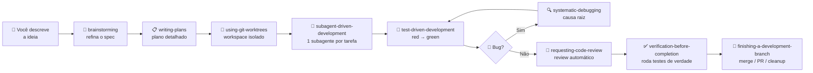

# 🦸 Superpowers

> **Plugin oficial** · `superpowers@claude-plugins-official` · autor: [Jesse Vincent (obra)](https://github.com/obra/superpowers) · versão atual: 5.1.0
>
> *"Uma metodologia completa de desenvolvimento de software para seu agente de código, montada sobre skills composáveis e instruções iniciais que garantem que ele as use."*

---

## 🎯 O que é

O **Superpowers** não é uma skill — é uma **biblioteca de 14 skills + hooks** que transformam o Claude em um engenheiro disciplinado:

- 🧠 **Pensa antes de codar** — força brainstorming e design antes de implementar
- 🧪 **Faz TDD de verdade** — escreve o teste, vê falhar, escreve o código
- 🔍 **Debuga sistematicamente** — encontra a causa raiz em vez de empilhar patches
- 👥 **Trabalha em paralelo** — dispara subagentes para tarefas independentes
- ✅ **Verifica antes de declarar pronto** — roda os testes, não confia em "deve estar funcionando"
- 📝 **Documenta o plano** — entrega um implementation plan antes de tocar em código

> **Como ativa?** As skills disparam **automaticamente** com base em gatilhos no `description` de cada uma. Você não precisa lembrar de invocar — quando o contexto bate, o Claude usa.

---

## 🗺️ Fluxo de trabalho (visão de alto nível)



> **Tradução prática:** você diz *"quero adicionar X"* e o Claude entra num loop de brainstorming → plano → execução por subagentes → review → verificação → merge. Tudo isso **sem você ter que pedir cada passo**.

---

## 📚 As 14 skills do plugin

### 🟢 Discovery & Planning

| Skill | Quando ativa | O que faz |
| --- | --- | --- |
| `using-superpowers` | No início de toda conversa | Garante que o Claude consulte e use as outras skills |
| `brainstorming` | Antes de qualquer feature/componente novo | Explora intenção do usuário, levanta requisitos, propõe design — **bloqueia código antes do design aprovado** |
| `writing-plans` | Quando há spec mas ainda não tem código | Escreve plano "bite-sized" detalhado, com TDD, DRY, YAGNI embutidos |

### 🟡 Execution

| Skill | Quando ativa | O que faz |
| --- | --- | --- |
| `using-git-worktrees` | Antes de executar um plano | Cria workspace isolado (worktree ou nativo do harness) |
| `subagent-driven-development` | Ao executar plano com tarefas independentes | Dispara um subagente fresco por tarefa, com review em duas etapas (spec + qualidade) |
| `executing-plans` | Quando você está num harness sem subagentes | Versão sequencial do `subagent-driven-development` |
| `dispatching-parallel-agents` | 2+ tarefas independentes | Roda investigações/fixes em paralelo (ex.: 3 testes quebrados em subsistemas diferentes) |

### 🟠 Quality

| Skill | Quando ativa | O que faz |
| --- | --- | --- |
| `test-driven-development` | Antes de escrever qualquer código de feature ou fix | Red → green → refactor de verdade — sem pular o "ver o teste falhar" |
| `systematic-debugging` | Em qualquer bug, falha de teste ou comportamento inesperado | Proíbe patches aleatórios. Achar causa raiz antes de propor fix |
| `requesting-code-review` | Ao concluir tarefa ou antes de merge | Dispara reviewer subagent com contexto curado |
| `receiving-code-review` | Ao receber feedback de review | Verifica antes de implementar, não concorda por reflexo |
| `verification-before-completion` | Antes de declarar "pronto", commitar ou abrir PR | Força rodar comandos de verificação e mostrar a saída — *evidência antes de afirmação* |

### 🔵 Wrap-up & Meta

| Skill | Quando ativa | O que faz |
| --- | --- | --- |
| `finishing-a-development-branch` | Implementação completa, testes passando | Apresenta opções: merge direto, PR, cleanup — e executa |
| `writing-skills` | Ao criar ou editar uma skill | TDD aplicado a documentação de processo — testa a skill com subagentes antes de "deployar" |

---

## ⚙️ Instalação

```bash
# 1. Adicionar o marketplace oficial (se ainda não tiver)
claude plugin marketplace add anthropics/claude-plugins-official

# 2. Instalar o plugin
claude plugin install superpowers@claude-plugins-official

# 3. Reiniciar a sessão do Claude Code
```

Verificar:

```bash
claude plugin list
# Esperado:
#   ❯ superpowers@claude-plugins-official
#     Version: 5.1.0
#     Status: ✔ enabled
```

> **Ambiente VSCode?** O `/plugin` não funciona dentro da extensão VSCode. Use sempre `claude plugin` no terminal externo. Após instalar, **reinicie** o VSCode/extensão para o plugin aparecer.

---

## 🎬 Exemplos de uso (antes vs depois)

### Cenário 1 — Adicionar uma feature

**Sem Superpowers:**

> Você: "Adiciona um botão de dark mode."
> Claude: *começa a editar `App.tsx` direto, sem perguntar onde mora o tema, se já existe sistema de design, se persiste em localStorage...*

**Com Superpowers:**

> Você: "Adiciona um botão de dark mode."
> Claude: *invoca `brainstorming`* — "Antes de codar: onde você quer o toggle? Header global ou settings? Deve persistir entre sessões? Já existe um sistema de design tokens?"
> *Depois do design aprovado, invoca `writing-plans`, gera plano com 4 tarefas, e só então começa a executar via `subagent-driven-development` com TDD.*

### Cenário 2 — Bug report

**Sem Superpowers:**

> Você: "O teste `auth.test.ts:42` está falhando."
> Claude: *muda o `expect`, roda de novo, "deve estar funcionando agora".*

**Com Superpowers:**

> Você: "O teste `auth.test.ts:42` está falhando."
> Claude: *invoca `systematic-debugging`* — "Antes do fix: reproduzo o erro. Olho o stack trace completo. Identifico a hipótese. Confirmo com print/log. Só então proponho o fix — e ele vai cobrir a causa raiz, não o sintoma."

### Cenário 3 — Várias tarefas independentes

**Sem Superpowers:** Claude faz uma de cada vez, sequencialmente, queimando seu contexto.

**Com Superpowers:** invoca `dispatching-parallel-agents`, dispara 3 subagentes em paralelo, cada um com contexto cirúrgico. Volta com 3 resultados independentes.

---

## 💡 Comandos úteis

Como o plugin opera por **gatilhos automáticos**, você raramente invoca skills diretamente. Mas pode forçar:

```text
/skill brainstorming                    # força brainstorming agora
/skill writing-plans                    # força criar plano
/skill systematic-debugging             # força debug metódico
/skill test-driven-development          # força TDD no próximo trecho
```

Lista completa de skills disponíveis (após instalar):

```bash
ls ~/.claude/plugins/cache/claude-plugins-official/superpowers/*/skills/
```

---

## 🚦 Benefícios em números

| Aspecto | Sem Superpowers | Com Superpowers |
| --- | --- | --- |
| **Especificação** | Implícita, errada na metade | Explícita, aprovada antes do código |
| **Bugs** | Patches em cima de sintomas | Causa raiz documentada |
| **Testes** | Escritos depois (ou nunca) | Red/green real, antes do código |
| **Review** | Manual, esquecido | Automático em cada tarefa do plano |
| **Tempo do humano** | Vigilância contínua | Sessões autônomas de 1–2 horas |
| **Verificação** | "Acho que tá ok" | Output do comando provando que tá |

---

## ⚠️ Quando NÃO usar

- Scripts one-off, hotfix de 1 linha, ajustes triviais — o overhead de brainstorming + plano não compensa.
- Tarefas exploratórias ("me mostra como X funciona") — `brainstorming` vai te forçar a especificar antes da hora.
- Você quer controle granular sobre cada passo — Superpowers tende a executar autonomamente por horas.

> Para esses casos, desabilite temporariamente:
> ```bash
> claude plugin disable superpowers@claude-plugins-official
> ```

---

## 🔗 Links

- 📦 [GitHub do plugin](https://github.com/obra/superpowers)
- 🏪 [Marketplace oficial](https://github.com/anthropics/claude-plugins-official)
- 📖 [Docs internas do plugin](file://~/.claude/plugins/cache/claude-plugins-official/superpowers/5.1.0/README.md) (após instalar)
- 👤 [Autor — Jesse Vincent](https://github.com/obra)

---

## 📝 Status de estudo

- [ ] Instalei o plugin
- [ ] Li este resumo
- [ ] Testei o fluxo `brainstorming` em uma feature real
- [ ] Testei o fluxo `systematic-debugging` em um bug real
- [ ] Testei o fluxo `subagent-driven-development` em um plano grande
- [ ] Dominei: sei quando ativar e quando desabilitar
